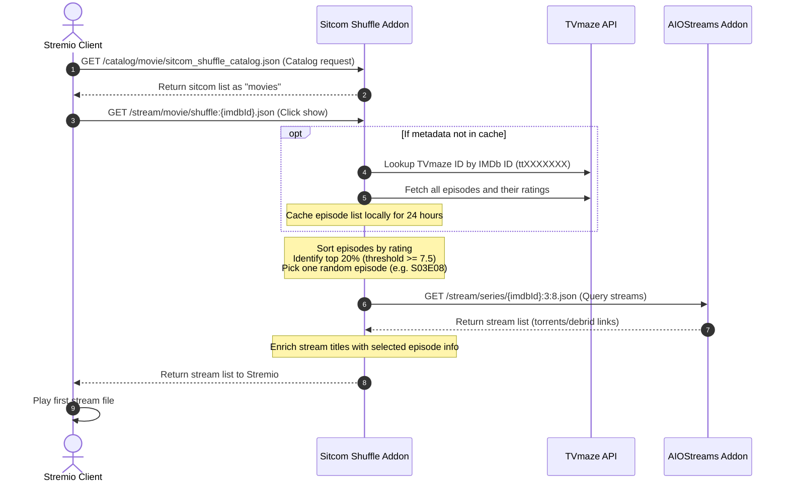

# Design Specification: Stremio Sitcom Shuffle Addon
**Date:** 2026-07-07  
**Status:** Approved  
**Topic:** Sitcom Shuffle Addon (True 1-Click play for random top-rated episodes)

---

## 1. Overview & Goals

The **Sitcom Shuffle Addon** is a custom Stremio extension designed for a frictionless TV viewing experience. The goal is to allow a user to click on a TV series in Stremio and have it immediately select a random highly-rated episode, fetch streams via the user's existing **AIOStreams** installation, and start playback.

### Key Objectives
* **True One-Click Play:** Bypass the season/episode selection screen in Stremio.
* **Highly Rated Selection:** Automatically filter and play only top-tier episodes (using a hybrid model: top 20% of episodes by rating, with a minimum rating of 7.5).
* **Frictionless Streaming:** Integrate with the user's existing AIOStreams setup (with TorBox) to leverage custom quality filtering and debrid links.
* **Zero Database/State:** The addon is completely stateless; user configurations are stored directly in the installation URL.

---

## 2. System Architecture

The addon is built as a lightweight Node.js/Express web server that conforms to the Stremio Addon Protocol.

### Components
1. **Configurator Page (`/configure`):** A static HTML/CSS/JS frontend that allows the user to paste their AIOStreams URL, search for shows using the TVmaze API, add them to their custom list, and generate the final Stremio installation link.
2. **Express Server:**
   * Decodes the configuration from the URL.
   * Exposes Stremio-compliant `manifest.json`, `catalog`, and `stream` endpoints.
   * Integrates with TVmaze to fetch and cache TV series episode lists and ratings.
   * Proxies stream requests to the user's AIOStreams instance.

### Data Flow


---

## 3. Stremio Addon Endpoints

The configuration is embedded as a Base64-encoded JSON string in the URL path:
`stremio://your-addon-domain.com/:config/manifest.json`

The JSON structure of `:config` is:
```json
{
  "aio": "https://aiostreams.elfhosted.com/YOUR_CONFIG_HASH",
  "shows": [
    { "id": "tt0898266", "name": "The Big Bang Theory" },
    { "id": "tt0386676", "name": "The Office" }
  ]
}
```

### 3.1. Manifest (`/:config/manifest.json`)
Exposes the addon configuration to Stremio. Shows are listed as `movie` type to bypass the Stremio series episode selector.

```json
{
  "id": "org.stremio.sitcomshuffle",
  "name": "Sitcom Shuffle",
  "version": "1.0.0",
  "description": "One-click to play a random highly-rated episode of your favorite sitcoms.",
  "resources": ["catalog", "stream"],
  "types": ["movie"],
  "catalogs": [
    {
      "type": "movie",
      "id": "sitcom_shuffle_catalog",
      "name": "Sitcom Shuffle"
    }
  ]
}
```

### 3.2. Catalog (`/:config/catalog/movie/sitcom_shuffle_catalog.json`)
Returns the list of configured shows.
* Each item maps its original series IMDb ID to a custom ID prefix: `shuffle:{imdbId}`.
* Poster images are fetched from Cinemeta's poster service: `https://images.metahub.space/poster/medium/{imdbId}/img.jpg`.

```json
{
  "metas": [
    {
      "id": "shuffle:tt0898266",
      "type": "movie",
      "name": "The Big Bang Theory (Shuffle)",
      "poster": "https://images.metahub.space/poster/medium/tt0898266/img.jpg"
    }
  ]
}
```

### 3.3. Stream (`/:config/stream/movie/shuffle:{imdbId}.json`)
When clicked, the addon selects an episode and queries the AIOStreams instance:
1. Decode `:config` to get the AIOStreams base URL.
2. Select a random episode using TVmaze rating data (see Section 4).
3. Fetch streams from: `{aio_base_url}/stream/series/{imdbId}:{season}:{episode}.json`.
4. Rewrite the stream object titles so the user knows which episode was picked:
   * `name`: `[Shuffle] S{season}E{episode}`
   * `title`: `{episode_title}\n{original_title}`
5. Return the list to Stremio with a `cacheMaxAge: 0` or low value to ensure a new random choice on the next click.

---

## 4. Episode Selection & Rating Logic

We use the free and keyless **TVmaze API** to retrieve episodes and ratings:
1. **Show Lookup:** `GET https://api.tvmaze.com/lookup/shows?imdb={imdbId}` to get the TVmaze show ID.
2. **Episodes Fetch:** `GET https://api.tvmaze.com/shows/{tvmazeId}/episodes` to get all episodes.
3. **Filtering Rules (Option C - Hybrid):**
   * Filter out episodes that do not have a rating or have `rating.average < 7.5`.
   * Sort the remaining episodes by rating to find the 80th percentile threshold (the top 20% highest-rated episodes).
   * Filter the list to include only episodes whose rating is greater than or equal to this threshold.
   * If no episodes satisfy the $7.5$ threshold, fallback to using the top 20% regardless of rating.
4. **Caching:** The resulting array of valid episode coordinates `{ season, number, name }` is cached in-memory (and optionally in a filesystem JSON cache) for 24 hours to prevent hitting TVmaze rate limits.

---

## 5. Configurator UI Design

The `/configure` page is a beautiful, modern responsive single-page web app built with Vanilla CSS.

* **AIOStreams Section:** An input field to paste the AIOStreams URL (with client-side validation to ensure it's a valid URL).
* **Show Search Section:** An input field with real-time debounced search. Queries `https://api.tvmaze.com/search/shows?q={query}` and displays results in a card grid with poster, title, and year.
* **Favorites Section:** A list of added shows with a **"+ Add"** / **"Remove"** toggle.
* **Action Section:** A **"Generate Install Link"** button that encodes the list and redirects the browser to `stremio://...` or displays a copyable installation URL.

---

## 6. Verification Plan

### Automated Tests
* Script to simulate a Stremio request:
  1. Call `/catalog` and assert the sitcom lists are returned.
  2. Call `/stream/movie/shuffle:tt0898266.json` and assert that a random top-rated episode's stream links are returned and correctly renamed.
* Unit tests for the rating filter logic (Option C) to ensure it correctly selects the top 20% $\ge$ 7.5.

### Manual Verification
* Deploy the addon locally and configure it using the webpage.
* Load the generated `stremio://` URL in the Stremio desktop client.
* Verify the catalog displays the sitcoms.
* Click on a sitcom and verify that a stream list is displayed showing the selected episode details.
* Click play and confirm it starts playing immediately.
